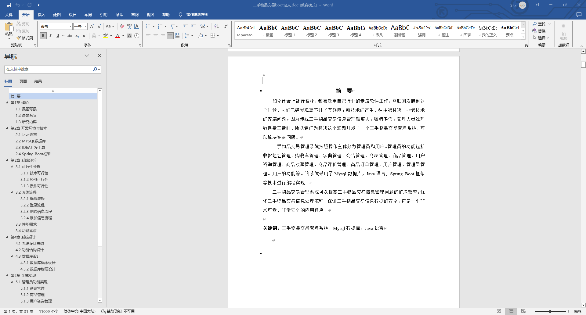
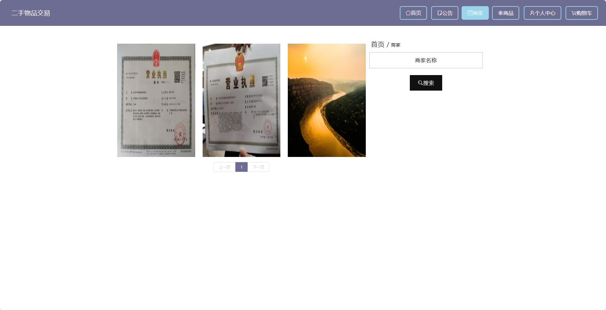
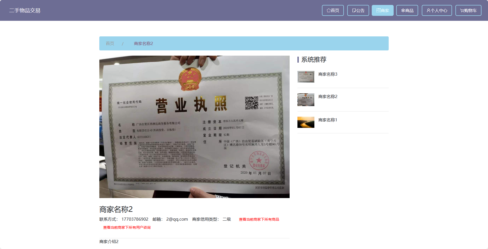
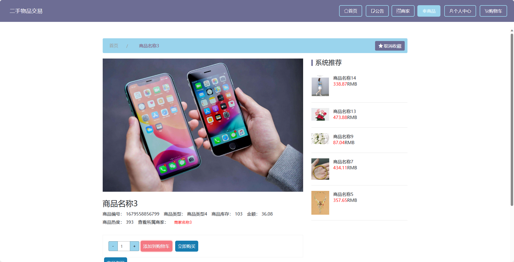
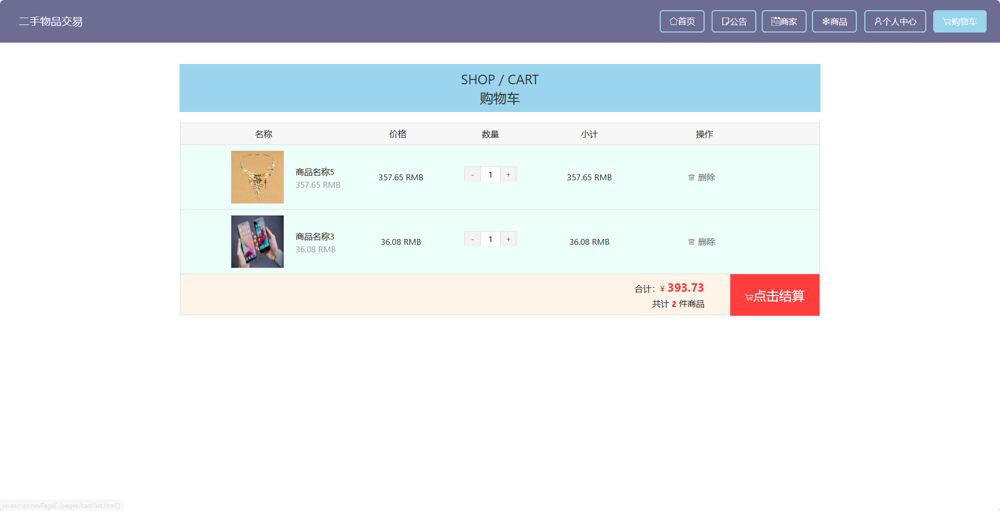
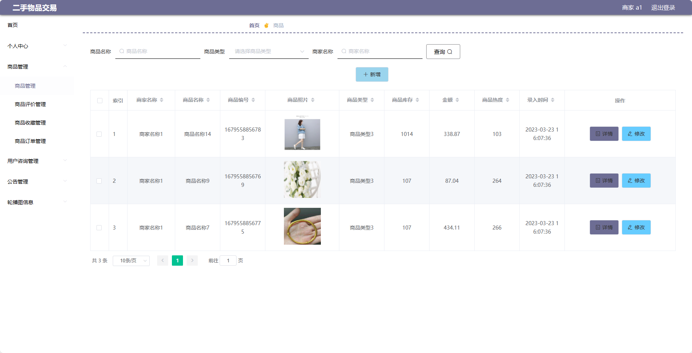
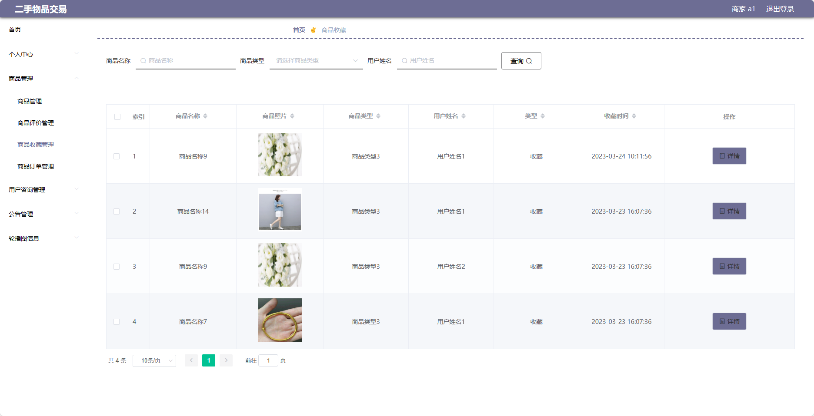

## 基于SpringBoot的二手物品交易平台(程序+报告)

###  获取sql数据库文件: 从戎源码网 (https://armycodes.com/) QQ: 386869957 QQ群: 377586148
###  所有系统地址: (https://github.com/YuLin-Coder/AllProjectCatalog) 
###  所有项目以及源代码本人均调试运行无问题 可支持远程安装部署调试、定制修改、代码讲解

## 项目介绍
基于SpringBoot的二手物品交易平台，系统包含三种角色：管理员、商家、用户,系统分为前台和后台两大模块，主要功能如下。

### 【管理员】:
1. 个人中心：管理员可以管理个人信息，包括修改密码、查看个人资料等。
2. 管理员管理：管理员可以对其他管理员进行添加、编辑、删除等操作。
3. 商家管理：管理员可以审核商家的注册申请，并对商家进行禁用或删除操作。
4. 用户管理：管理员可以查看用户列表，对用户进行禁用、删除等操作。
5. 商品管理：管理员可以对所有商品进行管理，包括编辑、删除等操作。
6. 用户咨询管理：管理员可以查看用户对商品的咨询留言，并进行回复和删除操作。
7. 公告管理：管理员可以发布平台公告，通知用户关于平台更新、活动等信息。
8. 基础数据管理：管理员可以管理系统的基础数据
9. 轮播图信息：管理员可以设置首页轮播图的图片及链接。

### 【商家】:
1. 个人中心：商家可以管理个人信息，包括修改密码、查看个人资料等。
2. 商品管理：商家可以新增、编辑、删除自己发布的商品。
3. 用户咨询管理：商家可以查看用户对商品的咨询留言，并进行回复。
4. 公告管理：商家可以发布平台公告，通知用户关于店铺活动、促销等消息。
5. 轮播图信息：商家可以设置首页轮播图的图片及链接。

### 【前台】:
1. 首页：展示平台的概况、推荐商品等信息。
2. 公告：发布平台的公告通知。
3. 商家：展示注册的商家信息。
4. 商品：展示所有在售的二手商品。
5. 个人中心：用户可以管理个人信息。
6. 购物车：用户可以将感兴趣的商品加入购物车。

## 项目技术
- 编程语言：Java
- 数据库：MySQL
- 项目管理工具：Maven
- 前端技术：HTML、CSS、JavaScript、Jquery、Vue
- 后端技术：Spring、SpringMVC、MyBatis

## 运行环境
- JDK版本：JDK1.8及以上
- 开发工具：IDEA、Ecplise、Myecplise都可以
- 数据库: MySQL5.7及以上
- Maven：maven3.0及以上
- Node：14.14.0及以上

## 运行截图

